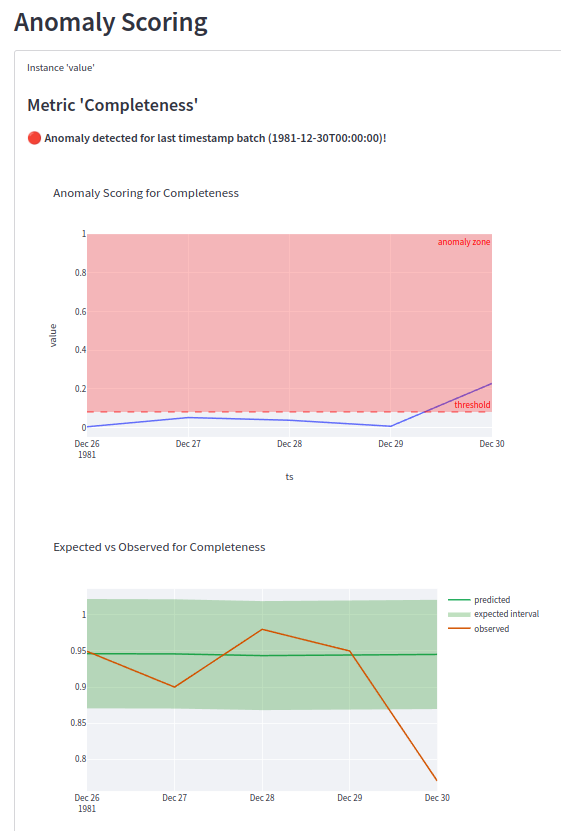
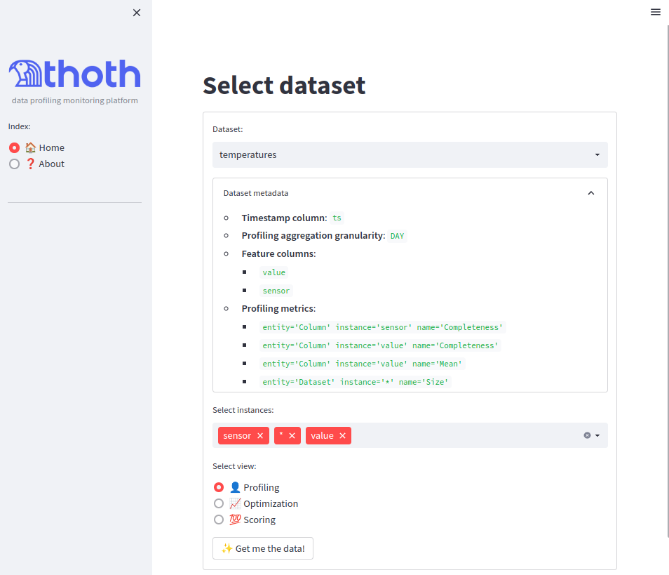

> ⚠️ **WIP** 👷 - soon to be released to [pypi.org](https://pypi.org)

____


_data profiling monitoring platform_


[](https://github.com/psf/black)
[](https://github.com/PyCQA/flake8)
[](https://pycqa.github.io/isort/)
[](http://mypy-lang.org/)
[](https://github.com/pytest-dev/pytest)


# Introduction
While the data and AI-driven culture emerge in several organizations, it is well
known that there are still many challenges in creating an efficient data operation. One
of the main barriers is **achieving high-quality data**. While more data brings more 
opportunities within the context of analytics and machine learning products, covering
this growing range of assets with quality checks becomes a real scalability issue. So
the big question is: how to create an efficient data quality service that covers as many
datasets as possible, does not require a lot of manual tuning, is computationally 
scalable, and with results that are easy to interpret?

This project main proposal is an automated end-to-end profiling-based data quality 
architecture. It implements profiling metrics computation, model optimization, anomaly 
detection, and generation of reports with high explainability.

By employing the most recent tools for data processing and AutoML aligned with modern 
data platform patterns it was possible to create an easy-to-use framework to empower 
developers and data users to build this solution.

## The Metrics Repository

The figure shows an overview of the entire flow: from the raw data to the 
decision-making regarding evaluating data quality.

First, in A, the raw dataset is transformed into aggregated profiling metrics by the 
profiler module and then saved in the Metrics Repository.

In B, all historical profiling from a given dataset is pulled
and used to optimize (train, evaluate, and select the best forecast model for each 
metric) and score all metrics. The anomaly scoring module implements this flow. The 
forecasts, scorings (errors), and optimizations for each metric are saved back to 
Metrics Repository.

Lastly, flow C, which is implemented by the quality assessment 
module, pulls the anomaly scorings for the latest data point and triggers a warning 
depending on the tolerance threshold found in the optimization, alerting the dataset 
owner about possible quality issues in the latest batch of data. 


## Monitor data profiling with simple commands! 🧐
```Python

import thoth as th

# init the Metrics Repository database
th.init_db(clear=True)

# profile the historical data, register the dataset in the Metrics Repository and 
# optimize ML models for all profiling time series.
th.profile_create_optimize(
    df=history_df,  # all your historical data
    dataset_uri="temperatures",  # identification for the dataset
    ts_column="ts",  # timestamp partition column
    session=session,  # sql session
    spark=spark,  # spark session
)

# assessing data quality for a new batch of data
th.assess_new_ts(
    df=new_batch_df,
    ts=datetime.datetime(1981, 12, 30),
    dataset_uri="temperatures",
    session=session
)
```

If a anomaly is detected for a new batch of data, this is the log you will receive
```
2022-10-20 14:44:20.959 | INFO     | thoth.quality:assess_quality:90 - 🔍️ Assessing quality for ts=1981-12-30 00:00:00 ...
2022-10-20 14:44:20.971 | ERROR    | thoth.quality:assess_quality:103 - 🚨 ️Anomaly detected, notifying handlers...
2022-10-20 14:44:20.972 | ERROR    | thoth.quality:_notify:75 - Anomaly detected for ts=1981-12-30 00:00:00 on dataset_uri=temperatures!
The following metrics have scores above the defined threshold by the optimization: [AnomalousScore(metric=Metric(entity='Column', instance='value', name='Completeness'), score=0.2275986301072123, threshold=0.08)]. 
Please check the dataset dashboard for more information: http://localhost:8501/?dataset_uri=temperatures&view=%F0%9F%92%AF+Scoring&instances=value
2022-10-20 14:44:20.973 | INFO     | thoth.quality:assess_quality:110 - 🔍️ Quality assessment finished, handlers notified!
2022-10-20 14:44:20.973 | INFO     | thoth.service_layer:assess_new_ts:493 - Pipeline finished!
```

Accessing the link in the logs 
(http://localhost:8501/?dataset_uri=temperatures&view=%F0%9F%92%AF+Scoring&instances=value)
will redirect you to the dashboard, which **explains the decision of the system**.



> _💡 While this example showed just a warning log, is possible to configure any custom 
> logic for the notification (like emails, slack, etc...)_

## Install the Thoth Python framework
```shell
pip install pythoth
```

## Quick Start in 2 simple steps

### 1) Start Dashboard and database (docker compose):

```shell
make app
```
Now the database for the Metrics Repository should be up and running, you can also 
access the dashboard at http://localhost:8501. But wait ✋ You don't have any data there 
yet to monitor. Let's start profiling and analyzing sampling datasets to get started!

### 2) Test the framework with the example notebooks (docker compose)
This command will spin-up another container with a Jupyter Notebook server with all the 
dependencies installed so you can test the framework easily.
```
make notebook-examples
```
You can open the notebook at http://localhost:8888. You should see the examples folder, 
start by the first example notebook.

After running the thoth commands there, you should be able to visualize the dataset and 
metrics in the UI:



## Development
After creating your virtual environment:

#### Install dependencies

```bash
make requirements
```

#### Code Style and Quality
Apply code style (black and isort)
```bash
make apply-style
```

Run all checks (flake8 and mypy)
```
make checks
```

#### Testing and Coverage
```bash
make tests
```
